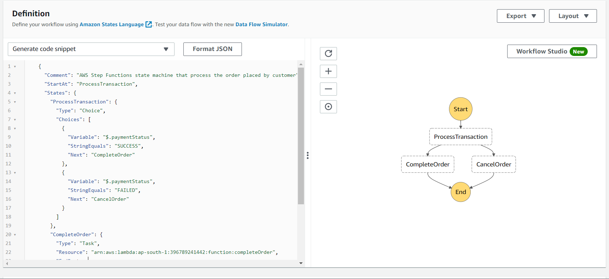
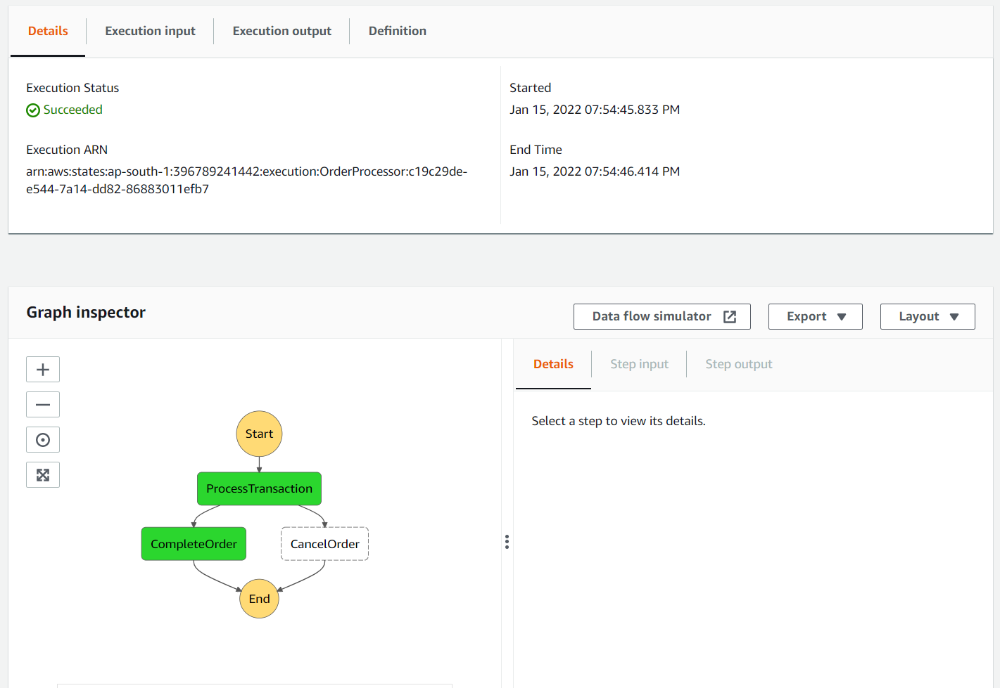
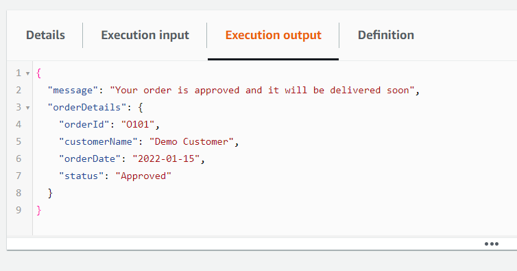
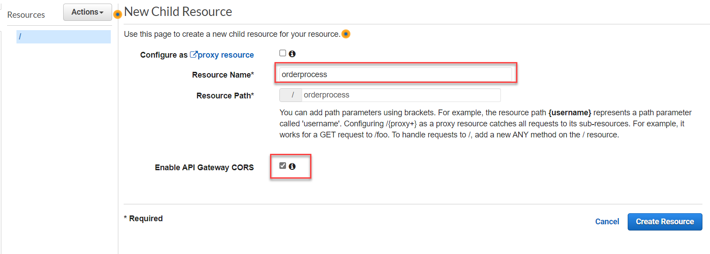
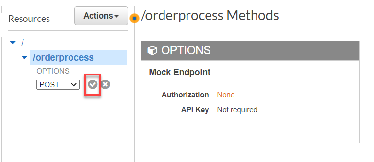
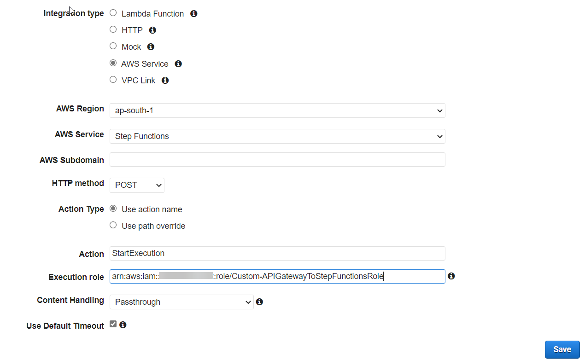
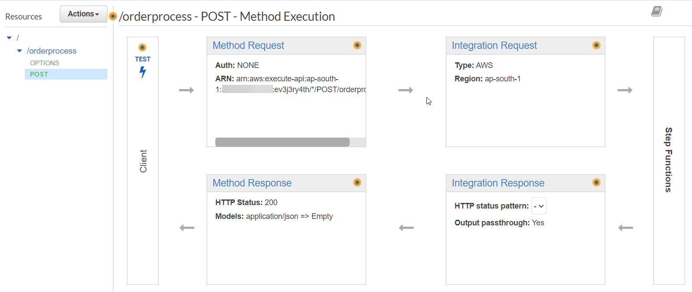
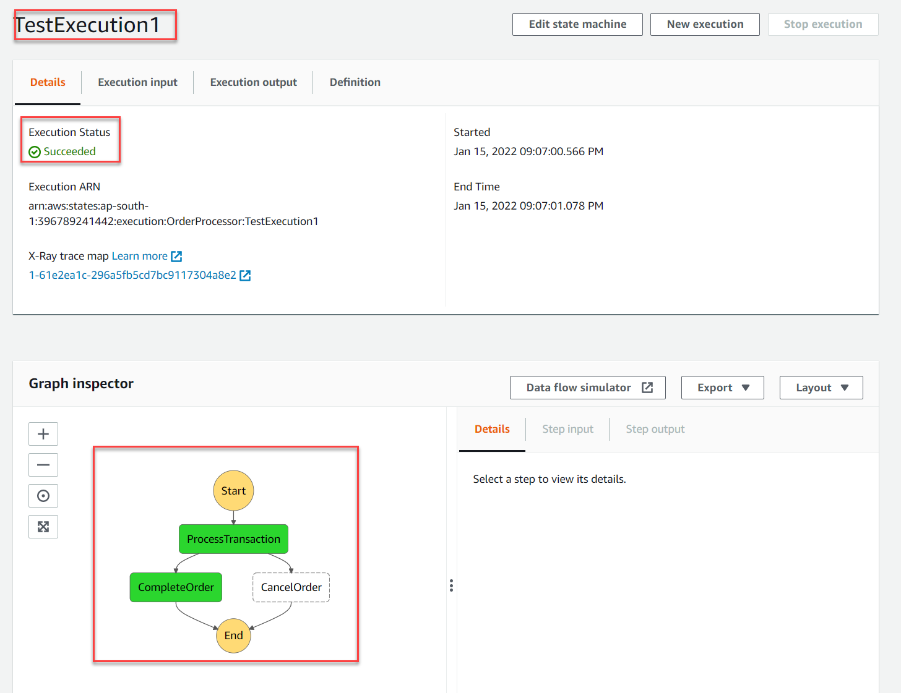
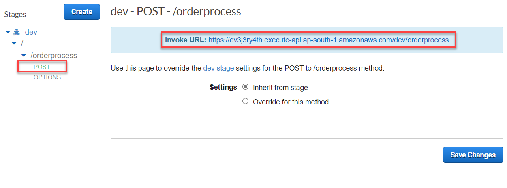

# Creating and invoking step functions using AWS API Gateway
AWS Step Functions is a low-code, visual workflow service that developers use to build distributed applications, automate IT and business processes, and build data and machine learning pipelines using AWS services. Workflows manage failures, retries, parallelization, service integrations, and observability so developers can focus on higher-value business logic.

## Create Lambda functions for Order processing
1) Open AWS management console and navigate to the Lambda console.
2) Click on `Create function` to create a new function.
3) Select `Author from scratch` and enter the function name as `completeOrder`. Choose `runtime` as `NodeJS 14.x`. Choose `Architecture` as `x86_64`. Leave other values as default and click on `Create function`.
4) Update the function code to the following 
    ```javascript    
    exports.completeOrder = async(event)=>{
    
        //Log event
        console.log("Received event from step function:", event);
    
        //Create response
        let data = {
            orderId: event.orderId,
            customerName: event.customerName,
            orderDate: event.orderDate,
            orderAmount: event.amount,
            status:"Approved"
        }
        //update orders table to store order details
        let response = {
            message: "Your order approved and it will be delivered soon",
            orderDetails:data
        }
        return response;
    }
    ```
5) Click on the `Deploy` button.
6) Scroll down to `Runtime settings` and click on the `Edit` button to update the handler name. Update the `Handler` name as `index.completeOrder` and choose `Save`.
7) Now, you need to create another function for handling order cancellation. Click on the `Create function` from the Lambda console.
8) Select `Author from scratch` and enter the function name as `cancelOrder`. Choose `runtime` as `NodeJS 14.x`. Choose `Architecture` as `x86_64`. Leave other values as default and click on `Create function`.
9) Update the function code with the following:
    ```javascript    
    exports.cancelOrder = async(event)=>{
    
        //Log event
        console.log("Received event from step function:", event);
    
        //Create response
        let data = {
            orderId: event.orderId,
            customerName: event.customerName,
            orderDate: event.orderDate,
            orderAmount: event.amount,
            status:"Rejected"
        }
        
        let response = {
            message: "Your order is not approved because of payment failure",
            orderDetails:data
        }
        return response;
    }
    ```
10) Click on the `Deploy` button.
6) Scroll down to `Runtime settings` and click on the `Edit` button to update the handler name. Update the `Handler` name as `index.cancelOrder` and choose `Save`.

## Create a service role for step function to work with Lambda
1) Navigate to the IAM console and click on the `Roles` section.
2) Click on the `create role` button.
3) Select `AWS service` and choose `Step functions` from the AWS services list and click on `Next:Permissions`.
4) In the permissions page, `AWSLambdaRole` will be selected by default. Click on next.
5) In the Review page specify the role name as `Custom-AWSStepFunctionServiceRole` and click `Create`. 
6) Select the newly created role from the Roles page and add the `CloudWatchFullAccess` policy to the permissions.

## Create a step function 
1) Open AWS management Console and navigate to Step functions service console.
2) Click on the `Create state machine` button to create a new workflow.
3) Select the option `Write your workflow in code` and choose the `Type` as  `Standard`. Click on `Next` button.
4) Specify the state machine name as `OrderProcessor` and choose the option `Select and existing role` under `Permissions`. Select the role which you have created in the previous step and select the log level as `ALL` and click `Create state machine`.
5) In the `OrderProcessor` state machine dashboard, click on the `Edit` button and add the folllowing lines of code to the workflow defenition area.
    ```json
    {
      "Comment": "AWS Step Functions state machine that process the order placed by customer",
      "StartAt": "ProcessTransaction",
      "States": {
        "ProcessTransaction": {
          "Type": "Choice",
          "Choices": [
            {
              "Variable": "$.paymentStatus",
              "StringEquals": "SUCCESS",
              "Next": "CompleteOrder"
            },
            {
              "Variable": "$.paymentStatus",
              "StringEquals": "FAILED",
              "Next": "CancelOrder"
            }
          ]
        },
        "CompleteOrder": {
          "Type": "Task",
          "Resource": "arn:aws:lambda:REGION:ACCOUNTID:function:FUNCTION_NAME",
          "End": true
        },
        "CancelOrder": {
          "Type": "Task",
          "Resource": "arn:aws:lambda:REGION:ACCOUNTID:function:FUNCTION_NAME",
          "End": true
        }
      }
    }
    ```

6) Replace the `resource` attribute value of the `CompleteOrder` task with the ARN of the `CompleteOrder` Lambda function ARN and the `resource` attribute value of the  `CancelOrder` task with the `CancelOrder` Lambda function ARN.
    
    

7) Click on the `Save` button to save the changes.
8) Go back to the `OrderProcessor` step fucntion dashboard and click on the `Start execution` button to do a test execution.
9) In the `Start execution` dialog box, specify the following data as input for the state machine and click `Start execution`.
    ```json
    {
        "orderId": "O101",
        "customerName": "Demo Customer",
        "orderDate": "2022-01-15",
        "orderAmount": 1400,
        "paymentStatus": "SUCCESS"
    }
    ```
10) After the execution is completed, you will see the execution status and flow in the page.
    
    

11) Click on the `Execution output` tab to see the output.
    
    

## Create an IAM Role for API Gateway
1) Before start creating the API gateway for Step functions, we need to create a service role that allows API gateway to invoke the Step function. For that navigate to the AWS mangement console and open the IAM console.
2) Select on the `Roles` from left pane and click on the `Create role` button.
3) On the `Select type of trusted entity` page, under `AWS service`, select `API Gateway` from the list, and then choose `Next: Permissions`.
4) On the `Attached permissions policy` page, choose `Next: Tags`.
5) On the `Add tags` page, enter any tags you want to add, then choose `Next: Review`.
6) On the `Review` page, enter `Custom-APIGatewayToStepFunctionsRole` for Role name, and then choose `Create role`.
7) After the role is created, on the `Roles` page, search for your role **(Custom-APIGatewayToStepFunctionsRole)**, and then choose the role.
8) On the `Permissions` tab, choose `Attach Policy`.
9) On the `Attach Policy` page, search for **AWSStepFunctionsFullAccess**, choose the policy, and then choose `Attach Policy`.

## Create an API Gateway for Step function invocation
1) Open the Amazon API Gateway console.
2) On the `REST API` pane, choose `Build`.
3) In the REST API creation page, choose `REST` for protocol and select `New API`.
4) In the `Settings` section, enter `OrderProcessorAPI` for the API name, and then choose `Create API`.
5) On the API dashboard, click on the `Actions` button and choose `Create Resource`.
6) On the New Child Resource page, enter `orderprocess` for Resource Name, select check box to enable the CORS and then choose `Create Resource`.

    

7) On the **/orderprocess** Methods page, choose `Actions` the nselect `Create Method`.
8) From the list, choose `POST`, and then select the check mark.

    

9) On the **/orderproces - POST** - Setup page, for `Integration Type`, choose `AWS Service`.
10) For `AWS Region`, choose a `Region` from the list.
11) For `AWS Service`, choose `Step Functions` from the list.
12) For `HTTP Method`, choose `POST` from the list.
    > [!NOTE]
    > All Step Functions API actions use the HTTP POST method.

13) For `Action Type`, choose Use `action name`.
14) For `Action`, enter **StartExecution**.
15) For `Execution Role`, enter the role ARN of the IAM role that you created earlier.
    
    

16) Click on `Save` to Create the integration.

    

## Test and Deploy the API Gateway API
1) On the **/orderprocess - POST** - Method Execution page, choose `Test`.
2) On the **/orderprocess - POST** - Method Test page, copy the following request parameters into the Request Body section using the ARN of the above created state machine (OrderProcessor), then choose Test.
    ```json
    {
       "input": "{ \"orderId\": \"O123\", \"customerName\": \"Customer 1\", \"orderDate\":\"2022-1-15\" , \"orderAmount\": 1200, \"paymentStatus\":\"SUCCESS\" }",
       "name": "TestExecution1",
       "stateMachineArn": "arn:aws:states:REGION:ACCOUNTID:stateMachine:STATEMACHINE_NAME"
    }
    ```
3) Open the `OrderProcessor` Step functions execution history, and you will be able to see the `TestExecution1` with success status.

    

4) To deploy your API, on the `Resources` page of **OrderProcessorAPI**, choose `Actions` and then select `Deploy API`.
5) In the `Deploy API` dialog box, select `[New Stage]` from the `Deployment stage` list, enter `dev` for Stage name, and then choose `Deploy`.
6) In the `Stages` section, expand `dev` stage and select POST method. You will be able to see the URL on the top 

    

9) You can use POSTMAN or any other REST API testing tool to test your api with this URL. You can also make calls to the API from applications to invoke the step function.
